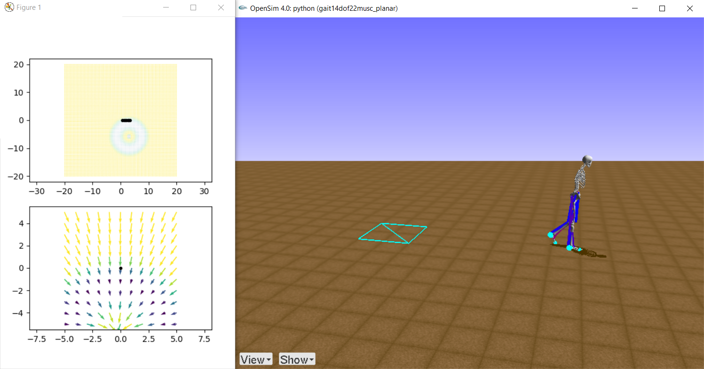

This repository contains software required for participation in the NeurIPS 2019 Challenge: Learn to Move - Walk Around. In this competition, your task is to develop a controller for a physiologically plausible 3D human model to move (walk or run) following velocity commands with minimum effort. Find out more about the challenge [**here**](https://www.aicrowd.com/challenges/neurips-2019-learning-to-move-walk-around).

<table style="background-color: #ffffff">
<caption align="bottom" style="padding-top: 0.3em; font-size: 0.8em">A 3D human musculoskeletal model (right) and target velocity maps (global map: top-left; local map: bottom-left).</caption>
<tr><td></td></tr>
</table>

## Mission

Bridge researchers from neuroscience, biomechanics, robotics, and machine learning to model neuro-muscular-skeletal dynamics of human movement

